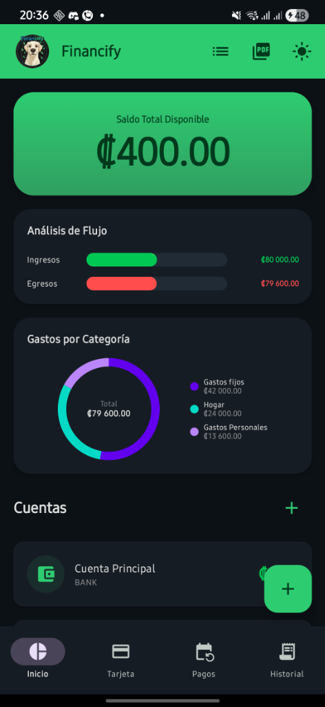
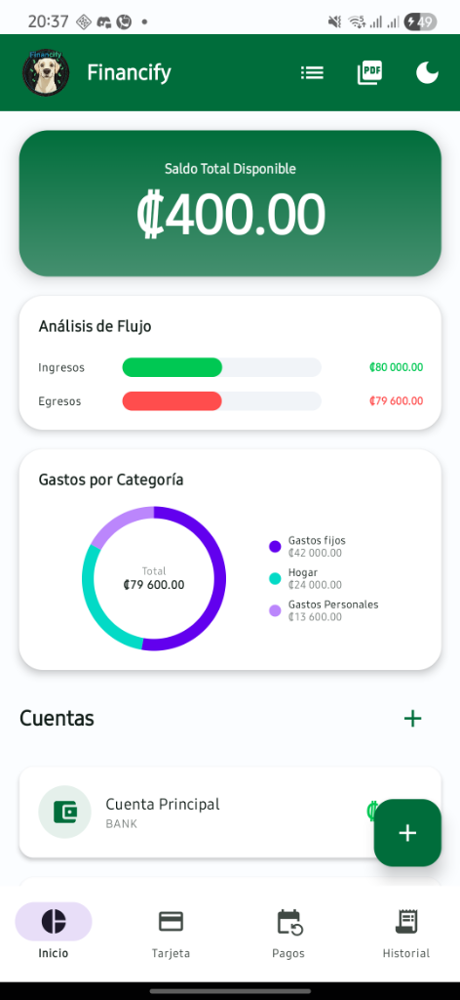
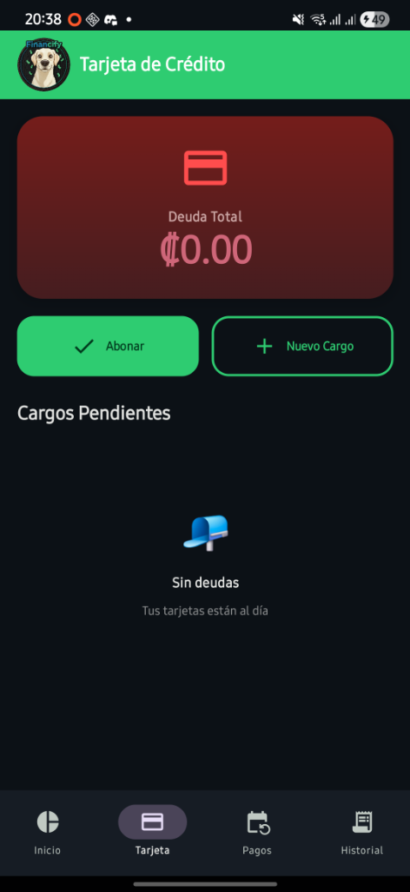
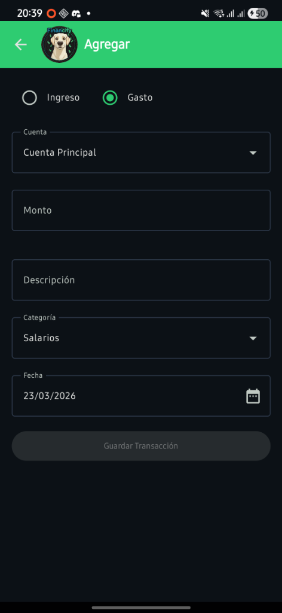
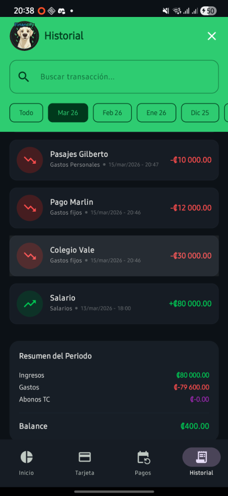
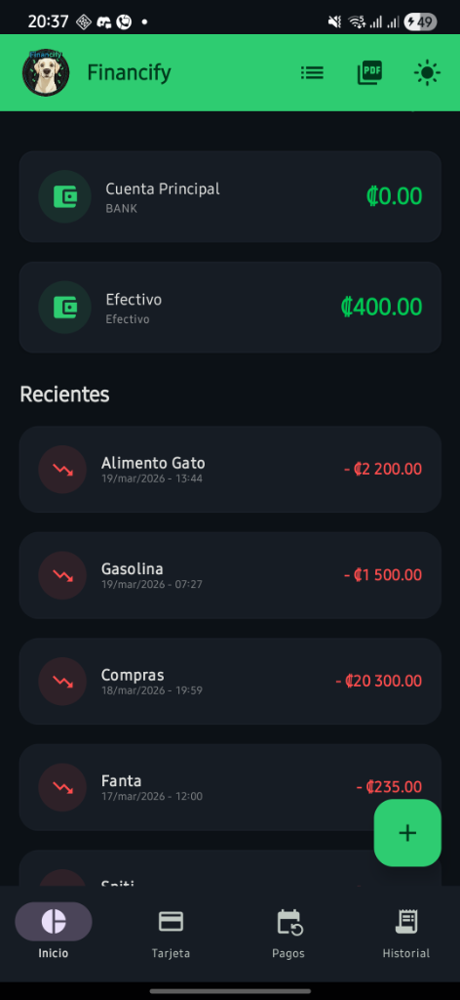
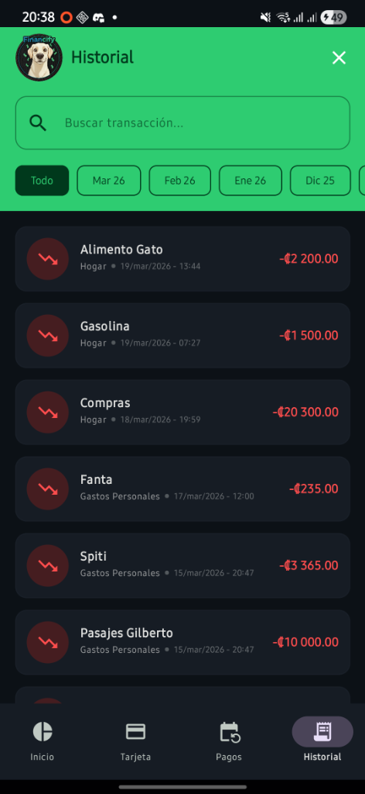
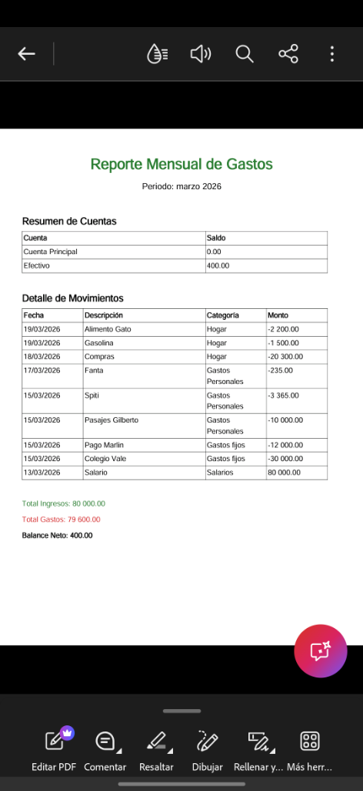
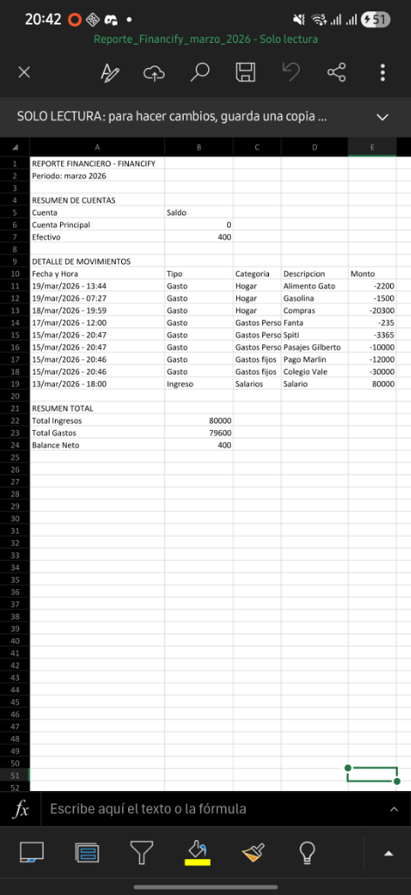

# 💰 Financify (Personal Accountant V2)


> **Financify** no es solo un registro de gastos, es un administrador financiero personal *Offline-First* diseñado para ser rápido, intuitivo y estéticamente superior. Permite a los usuarios recuperar el control total de su economía diaria sin depender de servidores externos.

---

## 📸 Screenshots

Aquí una demostración de la aplicación en funcionamiento:

<p align="center">
  
  
  
</p>
<p align="center">
  
  
  
</p>
<p align="center">
  
  
  
</p>

---

## 🎯 El Problema
Las personas pierden dinero no por grandes gastos, sino por la falta de un seguimiento claro de sus "gastos hormiga" y pagos recurrentes (como tarjetas de crédito). Las soluciones actuales suelen ser lentas, requieren crear cuentas, o exigen conexión a internet constante, exponiendo datos financieros sensibles en la nube.

## 💡 La Solución
Un **gestor local de finanzas (Offline-First)** que no requiere registros. Financify abre instantáneamente, permitiendo registrar una transacción en menos de 3 clics y visualizando la salud financiera en tiempo real a través de gráficos interactivos, dándole al usuario la tranquilidad de que sus datos nunca abandonan su dispositivo.

---

## 🚀 Funcionalidades Principales (Features)

*   **📊 Dashboard Estadístico en Tiempo Real:** Gráficos de anillo (Pie Chart) dinámicos nativos en Compose que desglosan los gastos por categoría, mostrando un resumen visual instantáneo del presupuesto.
*   **💳 Gestión Multicuenta:** Capacidad de manejar tanto efectivo como cuentas bancarias por separado, incluyendo gestión de deuda de Tarjetas de Crédito.
*   **🌙 Modo Oscuro Inmersivo (Material 3):** Diseño adaptativo que respeta el tema del sistema, optimizado con colores de alto contraste para reducir la fatiga visual.
*   **📄 Reportes Profesionales (PDF & Excel\*):** Motor de generación de reportes que exporta tablas de transacciones directamente a PDF (mediante `iTextPdf`) listas para imprimir o enviar. *(Excel en progreso)*.
*   **⚡ UX Fluida (Zero-Friction):** Swipe-To-Delete con animaciones físicas, selección masiva (Long-press), y persistencia inteligente (sembrado automático de datos default).
*   **⏱️ Precisión Temporal:** Registro exacto al minuto en el que se produce la transacción.

---

## 🏗 Decisiones Técnicas y Arquitectura (Under the Hood)

El verdadero valor de este proyecto está en su estructura. Está construido con base en la **Modern Android Architecture (Recommended by Google)**:

*   **Arquitectura MVVM (Model-View-ViewModel):** 
    Separación estricta de responsabilidades. La UI en Compose es completamente "tonta" y reactiva; simplemente refleja el `StateFlow` expuesto por los ViewModels.
*   **Single Source of Truth (Repository Pattern):**
    Toda la lógica de acceso a datos está abstraída en `FinanceRepository`. Los ViewModels nunca hablan directo con la DB, asegurando código altamente testeable y mantenible.
*   **Inyección de Dependencias (Dagger Hilt):**
    Gestión profesional del ciclo de vida de los componentes. El repositorio y las instancias de Base de Datos son inyectados como `Singletons`, evitando fugas de memoria y permitiendo testing automatizado en el futuro al poder inyectar versiones "Mock".
*   **Reactive Data Streams (Coroutines & Kotlin Flow):**
    Cada vez que se registra un gasto en la DB (`Room`), la consulta devuelve un Flow que se recolecta en la UI mediante `collectAsStateWithLifecycle`. **El Dashboard se actualiza mágicamente sin necesidad de llamadas de recarga manuales.**

### 🛠️ Tech Stack & Librerías
*   **UI:** Jetpack Compose (Material Design 3, Animation, Navigation)
*   **Arquitectura:** ViewModels, Lifecycle
*   **Asincronismo:** Kotlin Coroutines & StateFlows
*   **Base de Datos Local:** Room Database (SQLite abstraction)
*   **Dependency Injection:** Dagger Hilt (KSP)
*   **PDF Generation:** `com.itextpdf`

---

## 🔧 Instalación y Despliegue

1. Clona este repositorio:
   ```bash
   git clone https://github.com/IsaacAburto1548/PersonalAccountantV2.git
   ```
2. Ábrelo en **Android Studio Ladybug** (o la versión más reciente que soporte AGP 8+).
3. Deja que Gradle sincronice las dependencias.
4. Presiona `Run` usando un emulador o dispositivo físico corriendo **Android 8.0 (API 26)** o superior.

---

**Desarrollado con ❤️ por Isaac Aburto**  
*Ingeniería de Software & Desarrollo Móvil*
